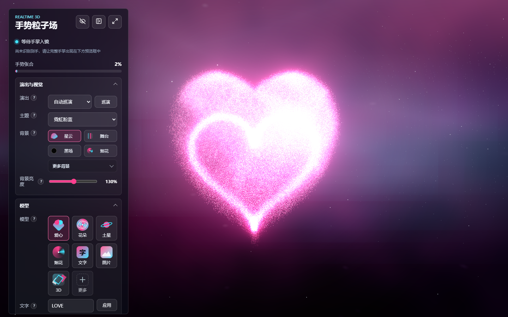
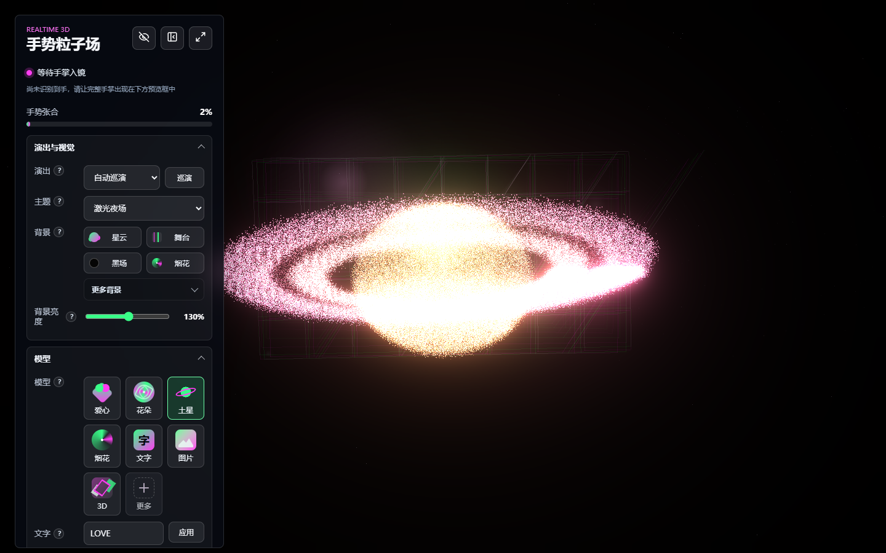
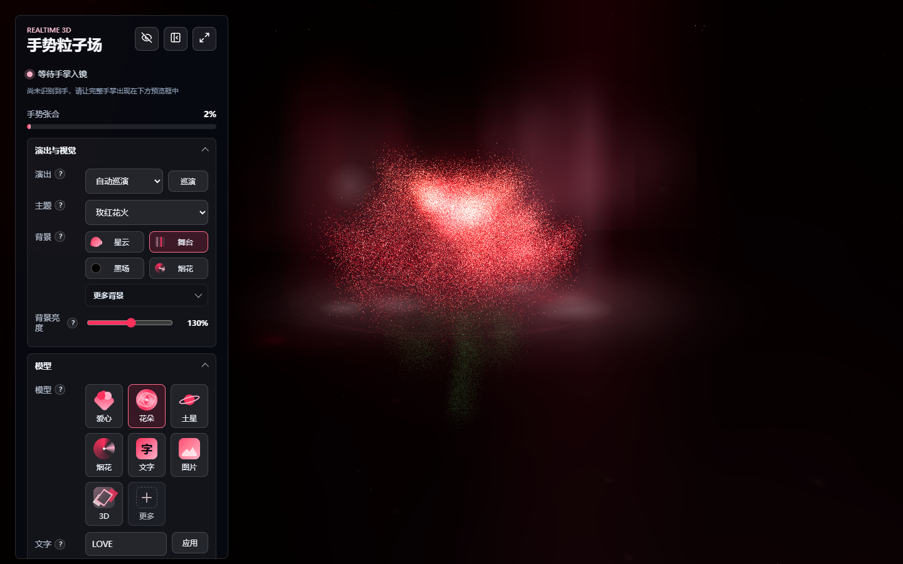

# Hand Particle System

一个基于 Three.js 和 MediaPipe Hands 的实时 3D 手势粒子系统。项目使用摄像头识别手部关键点，将手掌张合、双手距离和握拳姿态映射到粒子模型、文字粒子、背景氛围和音乐响应上，适合做互动展示、礼物屏幕或舞台视觉原型。

## 在线体验

已部署到 Vercel，可以先直接体验：

```text
https://hand-particle-system.vercel.app
```

## 示例效果

| 爱心粒子场 | 土星与光网背景 | 花朵粒子 |
| --- | --- | --- |
|  |  |  |

## 功能概览

- 3D 粒子模型：粒子组成带有厚度的 3D 爱心，也可以切换成全方位 3D 花朵、土星、待爆烟花、钻戒、生日蛋糕、气球、自定义文字、姿态视频粒子骨架、图片/Logo 点云、GLB/glTF 模型表面点云和 BVH 动作骨架。
- 手势控制扩散：张开手掌时粒子扩散、变亮；收拢或握拳时粒子聚回当前模型；食指指向会进入独立“指向模式”，让模型按指向方向持续移动并临时把扩散/收缩输入压到最低。
- 双手控制幅度：双手同时入镜时，双手距离会参与控制整体扩散幅度。
- 握拳视角控制：单手握拳后旋转拳头，可以进入自由视角控制，观察 3D 爱心。
- 模型缩略图选择：主面板保留爱心、花朵、土星、生日蛋糕、烟花、文字六个常用模型，戒指、气球、姿态、图片、3D 和预留入口收进“更多模型”，切换时粒子会先散开再重组。
- 自定义文字粒子：输入名字或短句后，粒子可以组成更大、更细腻的文字；支持小麦手写、乐喵圆体、书坊颜体等偏可爱/俏皮的中文字体预设，并用更密的 Canvas 采样、字距、描边、倾斜、波浪、点缀和单字旋转做差异化采样。
- 图片/Logo 粒子：上传图片后会按透明度、亮度、Sobel 边缘梯度、局部明暗/颜色对比和色彩细节采样像素点，生成可随手势和音乐运动的粒子图形；支持轮廓增强、原色/灰度/单色、全局透明度、图片亮度、图片大小和二值 Logo 模式，并优先使用 Worker 高密度采样减少大图卡顿。
- AI 动捕动作文件：推荐先用 DeepMotion、Rokoko、Move AI、Plask 或 Blender 插件把视频转成动作文件；最佳导出为带角色和动画的 `.glb` / `.gltf`，可用 `.bvh` 动作，`.fbx` 建议先转成 GLB/glTF 或 BVH 后再导入。
- GLB/glTF 模型粒子：上传 `.glb` 或自包含 `.gltf` 后会按三角面面积在模型表面采样，生成真正有深度的 3D 粒子点云；带顶点色或 base color 贴图的模型会按 UV 采样颜色，尽量保留脸部、衣服图案、Logo 印花等贴图细节。带内置动画的文件会在后台播放，并按当前骨骼/节点姿态定时重采样成动态粒子，可单独调节密度、大小、厚度、表面雾化感、播放/暂停、循环、动画速度、动作跟随、朝向、地面高度和人物居中。
- BVH 动作粒子：上传 `.bvh` 动作文件后，系统会优先尝试把动作重定向到当前带骨骼的 GLB/glTF 人物；如果骨骼命名不匹配或尚未导入骨骼模型，则自动退回为 3D 粒子动作骨架播放，可调节骨架密度、循环、速度和大小。
- 姿态视频驱动：上传人物/舞蹈视频后，浏览器本地加载 MediaPipe Pose，识别头、肩、肘、腕、胯、膝、踝等人体关键点；如果当前已有带骨骼 GLB/glTF，系统会优先尝试把视频姿态映射到 3D 人物骨骼并实时重采样成动态粒子模型，匹配成功会提示“导入成功，已匹配 3D 人物”，匹配失败会提示“导入失败，已回退为粒子骨架”。
- GPU 粒子路径：粒子目标点、方向、半径、亮度等数据写入 GPU attribute，每帧位置变形、音乐扰动、扩散和烟花爆开主要在顶点 shader 中计算，减少高粒子档位下的 CPU 逐粒子更新压力；支持 WebGL2 和浮点渲染目标的桌面设备会额外启用 FBO 位置纹理模拟，让粒子追随更顺滑。
- 演出巡演与编排器：可以选择自动巡演、玫瑰告白、夜场烟花、图形展台、星河心动现场、心动告白礼、生日快乐派对等预设，也可以进入“自定义编排”编辑时间线，让主题、背景、模型、文字、亮度、图片大小、镜头、爆发和定格按片段自动切换；支持从 JSON 文件或 `window.handParticleShows.importPreset()` 导入演出。
- 现场稳定性：系统区提供健康检查，显示 WebGL、摄像头、MediaPipe、麦克风、音频、资源、画质和 FPS 状态；“现场安全”会降低可见粒子量、Bloom 和背景复杂度，优先保证投屏稳定和主体辨识度。
- 分层控制面板：演出与视觉、模型、导入、交互、音乐和系统设置分区折叠；常见细项提供 `?` 说明，点击后会显示当前调整项的作用；影响较大的滑条带 `-` / `+` 微调按钮。
- 主题配色选择：通过下拉菜单选择主题，支持霓虹、金暖、冰蓝、紫绿、黑金、玫红、激光、落日、电紫等配色与场景氛围变量。
- 背景氛围：支持星云、柔光舞台、极简黑场、烟花夜空、极光帷幕、光网隧道、日落霓霞等多层电影感背景模式，并加入动态程序化天幕和“更多背景”入口。
- 音乐响应：支持麦克风或本地音频文件，平缓段尽量保持模型形状，鼓点/重音段会触发心跳缩放、快速位移、自身旋转、朝向变化、主题色呼吸光带加粒子云的战斗机式粗拖尾和 Bloom 律动。
- 手势指令：张开控制爆散，握拳/收拢聚回模型；伸出食指指向时进入指向模式，模型会按食指方向持续移动，期间会压低扩散/收缩并关闭拳头视角避免冲突。
- 手势灵敏度：可以分别调节张开/收拢响应阈值和食指指向移动幅度，适配不同摄像头和手型。
- 鼠标辅助预览：没有摄像头时，也可以使用鼠标旋转视角；按住 Shift 拖动可扰动粒子。
- 展示模式：可以一键隐藏控制面板，只保留一个浮动恢复按钮。

## 技术栈

- `Vite`：开发服务器和构建工具，当前使用 Vite 8。
- `Three.js`：3D 场景、GPU shader 粒子系统、GLB/glTF 与 BVH 读取、动画混合器、相机控制和 Bloom 后期效果，当前使用 Three.js 0.184。
- `@mediapipe/hands`：本地手部关键点识别。
- `@mediapipe/pose`：本地视频人体姿态关键点识别，用于姿态视频粒子骨架。
- `lucide`：控制按钮图标。
- `Playwright`：本地截图、交互和导入路径验证。

## 本地运行

安装依赖：

```bash
npm install
```

启动开发服务器：

```bash
npm run dev
```

浏览器打开：

```text
http://localhost:5173
```

如果需要让局域网内的其他设备访问，可以使用：

```bash
npm run dev:host
```

建议使用 Chrome 或 Edge，并在浏览器弹窗中允许摄像头权限。摄像头画面只在本地浏览器中交给 MediaPipe 做手势识别，不会上传到服务器。不要直接双击打开 `index.html`，也不要用 `dist/index.html` 的本地文件路径打开。

## 手势操作

1. 打开页面后，先看左侧面板底部的视频预览，确认能看到摄像头画面。
2. 把完整手掌放进预览框，手掌正对摄像头，手腕和五根手指尽量都入镜。
3. 单手张开时，粒子会扩散并变亮。
4. 单手收拢或握拳时，粒子会聚回模型。
5. 保持单手握拳并旋转拳头时，会进入拳头视角控制：
   - 旋转拳头：控制水平环绕视角。
   - 上下移动拳头：控制俯仰视角。
   - 松开拳头或张开手：恢复普通鼠标视角控制。
6. 双手同时入镜时，双手距离越远，整体扩散越明显；双手靠近会收拢。
7. 鼠标拖动画面可以旋转视角，滚轮可以缩放。
8. 按住 Shift 并拖动鼠标，可以在没有手势时局部扰动粒子。
9. 点击模型缩略图可以切换模型；主面板显示六个常用模型，其他模型可在“更多模型”里展开；选择“文字”后，输入文字、选择字体并点击“应用”即可生成文字粒子。
10. 上传图片/Logo 会生成图片粒子；DeepMotion 等外部 AI 动捕建议导出带角色和动画的 `.glb` / `.gltf` 后从“角色GLB”导入，系统会自动播放成动态点云；上传 `.bvh` 会尝试驱动当前骨骼模型，失败时会生成 3D 动作骨架；`.fbx` 建议先用 Blender 或动捕工具转成 GLB/glTF 或 BVH；上传人物或舞蹈视频会优先尝试驱动当前带骨骼 3D 人物，失败时生成跟随视频动作的姿态粒子骨架。
11. 只伸出食指时，模型会朝手指方向移动。
12. 切换到“烟花”模型后，张开手掌或点击画面可以触发烟花从上升轨迹爆开。
13. 点击“麦克风”或选择本地音频文件后，粒子会叠加音乐响应，底部会显示主题联动的音频条；点击“停止”可关闭音乐响应。

## 控制面板

左侧控制面板按层级模块组织：

- 顶部状态：摄像头/识别状态、诊断信息、帮助说明和手势张合百分比。
- 交互：手势开关、静止按钮、粒子颜色、张合灵敏度和指向灵敏度，默认放在面板靠上位置，方便频繁操作。
- 模型：两排六个常用模型缩略图、折叠的“更多模型”、文字输入、字体预设和模型亮度。
- AI 动捕 / 导入：图片/Logo、角色 GLB/glTF、BVH 动作与姿态视频导入、推荐格式提示、加载进度条和失败提示；外部 AI 动捕推荐 GLB/glTF，BVH 作为动作文件可用，FBX 建议先转换。GLB 细节可调密度、大小、厚度、表面雾化、播放/暂停、循环、速度、动作跟随、朝向、地面高度和人物居中；BVH 细节可调循环、骨架密度、速度和大小；姿态视频细节里可以开关“视频驱动 3D 人物”并调节驱动平滑，导入后会明确提示是否匹配到当前 3D 骨骼。
- 演出与视觉：演出预设、演出编排器、主题配色、常用背景、“更多背景”选择和背景亮度。
- 音乐：麦克风、本地音频、停止按钮和音量百分比。
- 系统：自动画质档位、近似 FPS、粒子数量、现场安全模式、健康检查和面板缩放。

带 `?` 的控件可以点击查看说明，帮助判断当前调整项会影响粒子、背景、导入还是手势。

诊断信息可以帮助判断当前问题在哪里。如果显示 `识别到 1 只手` 或 `识别到 2 只手`，说明手势识别已经成功；如果一直显示 `尚未识别到手`，说明摄像头画面里没有被 MediaPipe 识别出完整手掌。

## 演出编排器

在“演出与视觉”里展开“演出编排器”，可以把项目当成一个小型舞台时间线来用：

1. 选择一个演出预设。如果想从模板开始，先选自动巡演、玫瑰告白等预设；点击“应用 / 新增 / 复制 / 删除 / 捕获”时会自动切换并保存到“自定义编排”。
2. 点击时间线上的片段，右侧编辑当前片段的内容。
3. 点击“应用”会保存当前片段并立即预览；点击“巡演”会按时间线自动播放。
4. 点击“捕获”会把当前画面状态记录成一个片段，包括主题、背景、模型、亮度、图片大小和最近的镜头角度。
5. “导出”会把当前演出写成 JSON；修改或粘贴 JSON 后点“导入”即可恢复。自定义编排会保存在浏览器本地存储中。
6. “文件”可以直接选择 `.json` 演出文件导入，不需要复制粘贴。

每个片段支持这些字段：

- `label`：片段名称。
- `duration`：片段持续时间，单位毫秒；导入 JSON 时小于等于 `120` 的数字会按秒处理。
- `theme`、`background`、`model`、`text`：主题、背景、模型和文字内容。
- `modelBrightness`、`backgroundBrightness`、`imageBrightness`、`imageSize`：模型亮度、背景亮度、图片/Logo 亮度和图片大小，使用倍率，例如 `1.2` 表示 `120%`。
- `camera` / `cameraDuration`：镜头预设和转场时长，支持 `hold`、`front`、`close`、`wide`、`left`、`right`、`top`、`low`。
- `burst`：片段开始时触发一次爆发；烟花会绽放，其他模型会短促扩散。
- `freeze`：片段进入后先完成短暂过渡，再定格画面，适合截图或舞台停顿。

项目内置演出模板放在 `src/show-presets/`。新增随应用一起打包的模板时，复制一个 JSON，设置唯一 `id` 和 `label`，然后在 `src/show-presets/index.js` 中加入 `SHOW_PRESET_LIBRARY`。

运行时也可以从浏览器控制台或外部脚本导入：

```js
window.handParticleShows.importPreset({
  label: "我的演出",
  steps: [
    {
      label: "开场",
      duration: 8000,
      theme: "neon",
      background: "stage",
      model: "heart",
      camera: "close",
      burst: true,
    },
  ],
});
```

## 视觉与音频模式

### 主题配色

主题会同步影响粒子主色、粒子辅色、背景光晕、场景雾色、边缘高光和面板强调色：

- 霓虹粉蓝
- 金色暖光
- 冰蓝
- 紫绿
- 黑金

也可以继续使用颜色选择器微调粒子主色。

### 背景氛围

背景氛围独立于主题配色，但会读取当前主题的主色、辅色、雾色和边缘高光：

- 星云：带远景星尘、星云云雾、动态天幕和弱化后的螺旋光带。
- 柔光舞台：带体积感光束、地面光环、背景幕光和随音乐呼吸的舞台天幕。
- 极简黑场：弱化背景，突出主体粒子。
- 烟花夜空：加入远景烟花、上升轨迹、烟雾层和动态夜空辉光。
- 极光帷幕：用低亮度多层曲线做空间帷幕，适合文字、爱心和土星展示。
- 光网隧道：用透视网格和光点营造科技感空间，亮度克制，适合 3D/Logo 展示。
- 日落霓霞：暖色云带和地平线光环背景，适合告白、花朵和礼物屏幕。

如果背景在当前屏幕或投影环境中偏暗，可以提高“背景亮度”；如果背景抢走主体，可以反向压低。模型本身也有独立“模型亮度”，不会改变背景。

### 音乐响应

音乐响应默认关闭。开启后会根据频谱拆分低频、中频、高频、鼓点、瞬态和峰值，并影响模型缩放、旋转、位移、粒子轻微散射、点大小和 Bloom 强度。当前响应会降低音乐导致的粒子扩散权重，让模型在舞动时尽量保持原始形状，把明显鼓点、重音和峰值用于触发心跳缩放、方向位移、自身旋转、朝向变化和粗细递减的粒子拖尾。

- `麦克风`：请求浏览器麦克风权限，只在本地浏览器中分析音频。
- `音频`：选择本地音频文件播放并分析，不上传文件。
- `停止`：关闭当前音源并停止响应。

本地音频播放音量已做压低处理，底部 72 条加长音频条会跟随当前主题显示；频谱响应做了降饱和和中心强化处理，低频律动会集中在中间，每条频谱接近峰值时会增强光效，但整体阈值更高，避免整首歌长时间顶满。

### 模型细节

- 花朵：使用花茎、叶片、萼片、随机混合的外侧护瓣、多层杯状花瓣和中心花芯生成，默认使用红色花瓣和绿色茎叶；单瓣会加入不等长、偏角、高低起伏、卷边和细褶皱，让花冠更接近真实玫瑰的自然包裹感。
- 烟花：初始状态为多组从不同方向升起后的待爆小光团和更明亮的细尾迹；张开手掌后按烟花专属阈值绽放，每朵烟花会保持更清晰的圆润花冠、收束后的分组轨迹、独立爆点辨识度和前后空间层次。
- 土星：使用扁球、行星条带、多层倾斜星环和环带间隙增强辨识度。
- 戒指：由金色椭圆戒托、顶部多面钻石和钻光星屑组成，适合告白、纪念日和求婚式演出。
- 生日蛋糕：由多层椭圆蛋糕、奶油边、彩色蜡烛、火焰和撒花粒子组成，适合生日许愿和派对开场。
- 气球：由多组彩色气球、绳线和散落彩纸组成，适合生日派对、祝福和轻快转场。
- 姿态：上传人物/舞蹈视频后，系统会用 MediaPipe Pose 提取人体关键点。若当前已导入带骨骼 GLB/glTF 且“视频驱动3D”开启，会根据肩-肘-腕、胯-膝-踝、肩胯中心等方向实时旋转匹配到的 humanoid 骨骼，再重采样当前姿态下的 3D 粒子模型；驱动层会做骨骼别名/层级补全、身体比例感知、脚底接触稳定、低置信度保持和平滑旋转限幅，减少脚部漂移和四肢抖动。若没有合适骨骼，则把肩、肘、腕、胯、膝、踝等连接成发光粒子骨架。视频只在本地浏览器中解码和识别，不上传服务器；导入面板可调骨架密度、跟随频率、关节/端点光晕和 3D 驱动平滑。
- 文字：通过 Canvas 采样生成目标点，支持字体预设和自动分行。
- 图片/Logo：优先在 `src/image-worker.js` 中通过 Worker + OffscreenCanvas 读取像素透明度、亮度和颜色，失败时回退到主线程采样；采样流程会先灰度化并进行 3x3 高斯模糊，再结合 Sobel 梯度、局部明暗对比、局部颜色对比、透明边缘和色彩饱和度进行自适应采样。普通图片会降低过度边缘偏置以保留内部纹理，Logo 模式使用 Otsu 二值阈值和透明边缘补偿保留轮廓。图片原色会按接近浏览器显示的色彩空间直接进入顶点颜色，shader 只做保色提亮和低眩光压白；导入面板可单独调整图片亮度和图片大小，图片大小调小时会同步减少可见粒子数，最大时使用当前画质档的全部粒子。
- GLB/glTF 模型：通过 `GLTFLoader` 读取 `.glb` 或自包含 `.gltf`，按网格三角面面积在模型表面高密度采样并归一化到粒子空间；如果网格带有 vertex color，会按三角形重心插值颜色；如果材质带 base color 贴图，会用采样点重心坐标插值 UV，再从贴图像素中读取颜色，并兼容透明贴图和 emissive 贴图的亮度加成。带内置动画的模型会保留 glTF 场景和 `AnimationMixer`，按固定采样计划持续读取当前姿态，重写可见粒子目标，让骨骼人物、节点动画模型或带动作的角色以粒子点云方式跳动。导入面板可调 GLB 点云密度、大小、前后厚度、表面微抖动、播放/暂停、循环、动画速度、动作跟随频率、朝向、地面高度和人物居中。
- BVH 动作：通过 `BVHLoader` 读取 `.bvh`，优先用 `SkeletonUtils.retargetClip` 按骨骼命名匹配重定向到当前带骨骼 GLB/glTF；匹配不足或重定向失败时，会把 BVH 骨骼父子连接直接转换为 3D 发光粒子骨架，保留头、手、脚等端点光晕。BVH 粒子骨架可单独调节循环、密度、速度和大小；导入提示会区分“已匹配当前 GLB/glTF 骨骼”和“匹配不足，已回退为粒子动作骨架”。

## 画质策略

项目会在启动时根据设备和窗口尺寸自动选择粒子数量：

- 桌面端默认使用约 `520k` 粒子，让爱心、花朵、Logo 和烟花更饱满。
- 移动端默认使用约 `160k` 粒子，在密度和发热之间折中。
- 高 DPR 的平板或中等设备会使用约 `320k` 粒子的均衡档。
- `ultra` 档约 `900k` 粒子，用于高性能桌面展示和更细的图片/Logo 还原。

图片/Logo 导入会根据画质档位生成更大的采样池：移动端约为粒子数 `2.8` 倍，桌面端约为 `3.4` 倍，`ultra` 最高约 `2.4M` 个候选采样点；静态 GLB/glTF 表面采样上限最高约 `980k` 点。动画 GLB/glTF 和姿态视频驱动 3D 人物会使用固定采样计划和较克制的实时采样上限，约从 `76k` 到 `260k` 点，避免每个动作帧都重写整档粒子。姿态视频和 BVH 粒子骨架会按画质档位自适应生成骨架采样点，并且只重写当前可见粒子目标，避免动作驱动把主线程拖慢。

在支持 WebGL2、顶点纹理和浮点/半浮点渲染目标的非移动端画质档位中，项目会自动启用 FBO ping-pong 位置纹理模拟；不满足条件时会回退到 attribute + uniform 的顶点 shader 路径。

可以通过 URL 强制指定画质：

```text
http://localhost:5173/?quality=compact
http://localhost:5173/?quality=balanced
http://localhost:5173/?quality=desktop
http://localhost:5173/?quality=ultra
```

## 项目结构

```text
.
├─ index.html
├─ package.json
├─ README.md
├─ start.bat
├─ vite.config.js
├─ docs/
│  └─ images/
├─ public/
│  └─ mediapipe/
│     ├─ hands/
│     └─ pose/
├─ scripts/
│  ├─ fixtures/
│  └─ verify.mjs
└─ src/
   ├─ audio.js
   ├─ backgrounds.js
   ├─ config.js
   ├─ gestures.js
   ├─ image-worker.js
   ├─ lighting.js
   ├─ importers/
   │  ├─ bvh-importer.js
   │  ├─ mesh-importer.js
   │  └─ pose-video-importer.js
   ├─ particles.js
   ├─ motion/
   │  └─ pose-retarget-config.js
   ├─ main.js
   ├─ show-controller.js
   ├─ show-presets/
   ├─ shapes.js
   ├─ styles.css
   ├─ themes.js
   └─ ui.js
```

核心文件说明：

- `src/main.js`：Three.js 场景组装、主循环、摄像头初始化、手势指令、图片导入调度、动作/姿态接入、健康检查、现场安全和事件绑定。
- `src/importers/`：GLB/glTF 采样、BVH 文本解析和姿态视频元素加载等导入边界。
- `src/motion/`：姿态/骨骼重定向常量和骨骼命名归一化。
- `src/show-controller.js`：演出预设、镜头预设、自定义演出 JSON 规范化和演出选项列表。
- `src/audio.js`：麦克风/音频文件输入、频段分析、鼓点/峰值估算和音频条数据。
- `src/backgrounds.js`：星云、舞台、黑场、烟花等多层背景氛围图层。
- `src/themes.js`：主题预设数据、主题下拉选项、场景雾色和 CSS 变量同步。
- `src/particles.js`：粒子缓冲区、GPU shader 模拟、可选 FBO 位置纹理模拟、预计算数据和粒子动画 uniform 更新。
- `src/shapes.js`：爱心、花朵、土星、烟花、戒指、蛋糕、气球、文字和通用点云粒子模型的目标点生成。
- `src/gestures.js`：手部张合、OK/比心/食指指向和拳头视角控制所需的手势计算。
- `src/image-worker.js`：图片/Logo 像素预处理、边缘/纹理采样和点云生成 Worker。
- `src/lighting.js`：背景柔光、光源颜色和呼吸动画。
- `src/show-presets/`：随应用打包的演出 JSON 预设和注册入口。
- `src/ui.js`：面板缩放、折叠/隐藏、状态文字、主题/模型/演出编排器/音频控件。
- `src/styles.css`：页面布局和控制面板样式。
- `index.html`：页面结构。
- `public/mediapipe/hands`：MediaPipe Hands 的本地模型和 wasm 资源。
- `scripts/verify.mjs`：使用 Playwright 进行桌面和移动端截图验证。
- `start.bat`：Windows 下的一键启动脚本。

## 可用脚本

启动开发环境：

```bash
npm run dev
```

启动局域网可访问的开发环境：

```bash
npm run dev:host
```

构建生产版本：

```bash
npm run build
```

预览生产构建：

```bash
npm run preview
```

局域网预览生产构建：

```bash
npm run preview:host
```

运行截图验证：

```bash
npm run verify
```

完整检查：

```bash
npm run check
```

`npm run verify` 会在 `5173` 没有服务时自动启动开发服务器，并生成：

```text
verification-desktop.png
verification-mobile.png
```

这些截图用于检查页面是否能正常渲染。验证脚本还会直接采样 WebGL canvas，捕获控制台错误、页面异常、请求失败和资源 404，并额外覆盖模型/背景/主题切换、文字刷新、手势/静止按钮和图片导入路径；它使用的是假摄像头，不能代表真实手势识别效果。

## 常见问题

### 摄像头无法使用

请确认：

- 使用的是 `http://localhost:5173`。
- 浏览器允许了摄像头权限。
- 摄像头没有被其他软件占用。
- 不要直接用本地文件路径打开页面。

浏览器通常只允许 `localhost` 或 HTTPS 页面访问摄像头。普通局域网 HTTP 地址可能会被拦截。

### 一直识别不到手

可以尝试：

- 让手离摄像头远一点，保证完整手掌入镜。
- 避免只露出手指或半只手。
- 保持光线充足，避免逆光。
- 手掌正对摄像头。
- 刷新页面后重新授权摄像头。

### 显示识别到了手，但粒子不明显变化

检查左侧的手势张合百分比。如果百分比变化很小，说明当前手势幅度不够明显。尝试更夸张地张开手掌或握拳，也可以调低“手势灵敏度”滑杆，让系统更容易响应张开/收拢动作。

### 自定义文字没有显示

可以尝试：

- 在模型缩略图里切换到“文字”。
- 选择合适的字体预设。
- 输入文字后点击“应用”。
- 文字尽量控制在 `18` 个字符以内，过长的文字会被自动分行并缩放。
- 如果刚切换过模型，等待散开重组动画完成后再观察。

### 麦克风或音频没有响应

请确认：

- 点击“麦克风”后允许浏览器麦克风权限。
- 页面运行在 `localhost` 或 HTTPS 地址下。
- 本地音频文件已成功选择并开始播放。
- 如果切换音源后没有变化，先点击“停止”，再重新选择麦克风或音频文件。

音频只在本地浏览器中分析，不会上传到服务器。

### Cloudflare Tunnel 分享后摄像头或麦克风异常

推荐启动方式：

```bash
npm run dev:host
```

然后另开一个终端运行：

```bash
cloudflared tunnel --url http://localhost:5173
```

远程体验时需要注意：

- 访问者打开的是 Cloudflare 提供的 HTTPS 地址，并在浏览器中允许摄像头/麦克风权限。
- 如果出现循环报错或识别一直初始化，先刷新页面，再确认摄像头没有被其他软件占用。
- 优先使用 Chrome 或 Edge；部分手机浏览器会更严格地限制摄像头、麦克风和 WebGL。
- 如果远程页面能打开但手势无效，先检查左侧诊断信息和视频预览是否有画面。

### MediaPipe 模型加载失败

确认 `public/mediapipe/hands` 目录存在，并且里面的 `.wasm`、`.tflite`、`.binarypb` 文件没有被删除。这些资源用于本地手势识别。

### 页面空白或控制台报错

先运行：

```bash
npm run build
```

如果构建失败，根据终端输出修复错误。构建成功后再重新启动开发服务器。

## 开发提示

- 粒子数量和画质档位在 `src/config.js` 中调整；桌面端默认保留较高粒子密度。
- 主题配色预设在 `src/themes.js` 中调整，面板强调色通过 CSS 变量同步，选择控件在 `src/ui.js` 中生成。
- 背景氛围在 `src/backgrounds.js` 中调整，可以扩展新的空间粒子、舞台光或夜空效果。
- 麦克风和本地音频分析在 `src/audio.js` 中调整，当前会输出 bass、mid、treble、beat、kick、onset、peak 和 bars。
- 粒子模型目标点在 `src/shapes.js` 中调整，文字粒子通过 Canvas 采样生成目标点，花朵/土星/烟花也在这里定义基础形态。
- 粒子运动、模型切换过渡、音乐瞬态响应和烟花爆开形态主要在 `src/particles.js` 的 `updateParticles` 中调整。
- 手势张合算法在 `src/gestures.js` 中调整。
- 控制面板、模型缩略图、字体选择、主题/背景/演出/音频控件、导入细节滑条和底部音频条在 `src/ui.js` 中调整。
- MediaPipe 文件路径由 `locateFile` 指向 `public/mediapipe/hands`。
- MediaPipe 使用动态导入，打包时会拆成独立 chunk；当前兼容 Vite 8 下 `@mediapipe/hands` 只暴露全局 `Hands` 的导出形态。
- 背景光源和粒子颜色会跟随主题、背景氛围和音乐强度联动。
- 手势识别结果会通过左侧诊断信息显示，调试交互时可以先看诊断文字。
