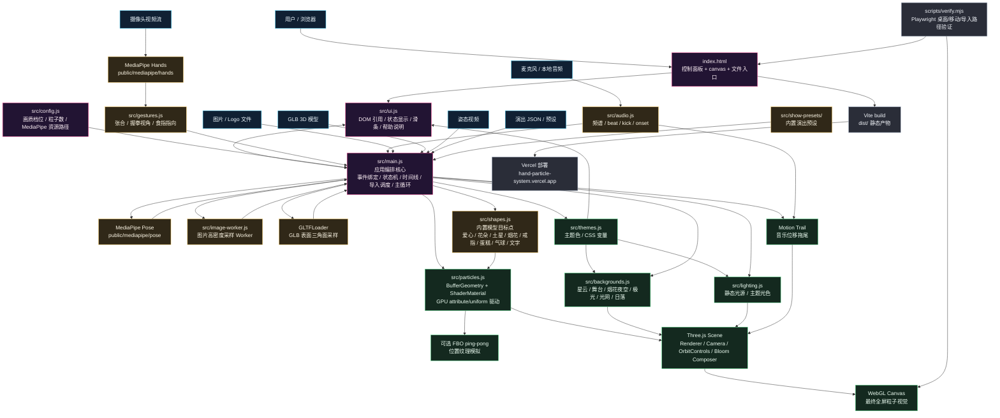

# Hand Particle System Architecture

这张图用于快速理解当前项目的模块分工和数据流。核心思路是：`src/main.js` 作为实时编排层，把手势、音乐、导入素材、演出时间线和 UI 参数合并成统一状态，再驱动 Three.js 场景、GPU 粒子系统、背景、灯光和后期效果。

## 模块边界速查

- `src/main.js`：项目中枢。不要把全部逻辑继续无限堆到 UI 或 shader 里，跨模块状态优先在这里协调。
- `src/particles.js`：性能核心。负责粒子 attribute、uniform、shader 和可选 FBO 模拟。
- `src/shapes.js`：目标点生成。新增内置模型时优先放这里。
- `src/ui.js`：只处理 DOM 引用、读写控件值和 UI 状态显示。
- `src/image-worker.js`：图片/Logo 的高密度采样路径，避免主线程卡顿。
- `public/mediapipe/*`：MediaPipe wasm/tflite/graph 资源，生产部署必须保留。
- `scripts/verify.mjs`：较大 UI、渲染、导入和移动端敏感改动后的自动检查入口。
